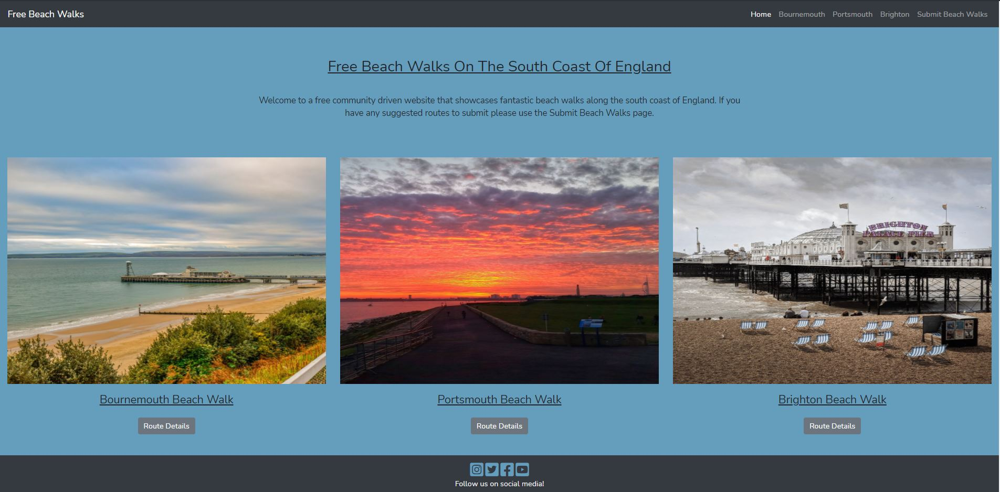
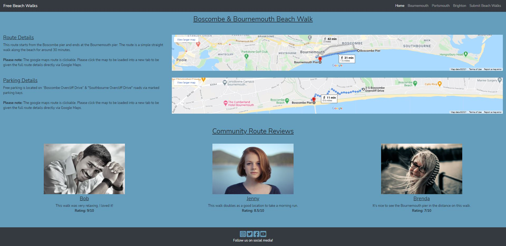
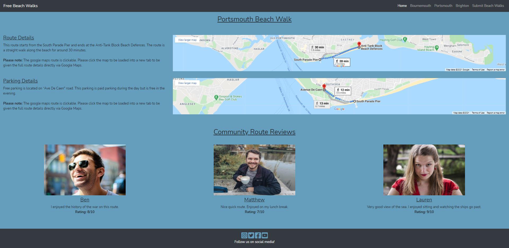
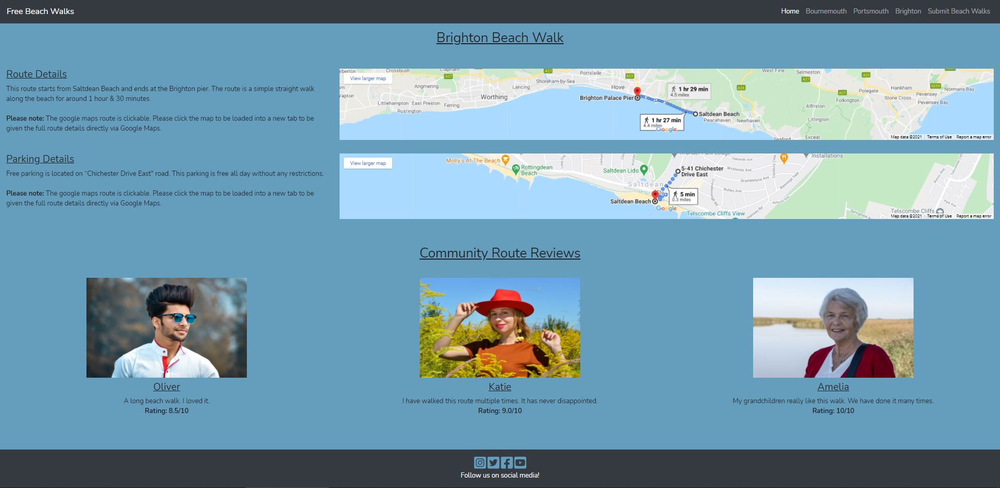
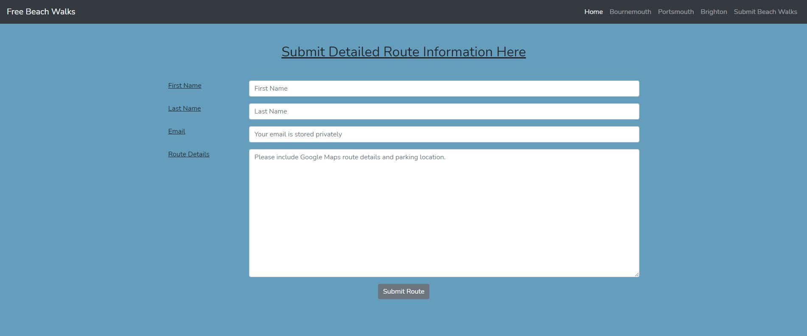
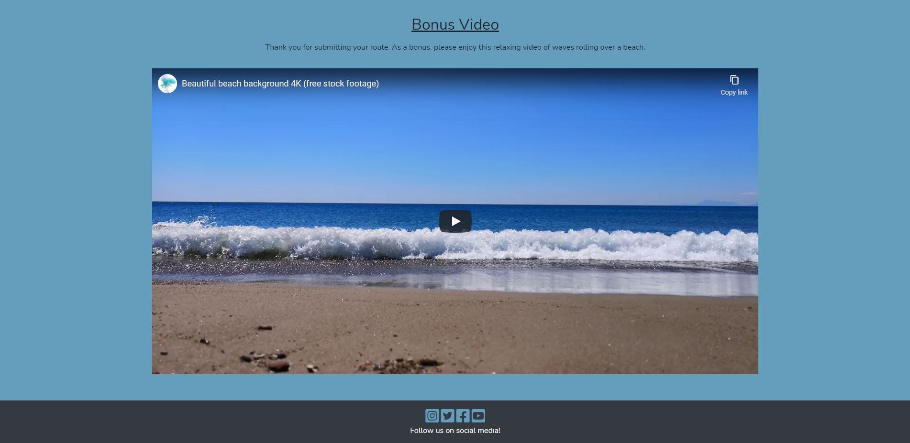

<h1 align="center">David Harris - Milestone Project 1</h1>

[Click here to view my live project]( https://davidhuk.github.io/David-Harris-MP1/)

## Completed Project Screenshots (Desktop View)

#### Home Page


#### Bournemouth Route


#### Portsmouth Route


#### Brighton Route


#### Submit Beach Walk Part 1


#### Submit Beach Walk Part 2


The aim of this project is to build at least a three-page static frontend mobile-first responsive website. I will be demonstrating the skills I have learnt in HTML, CSS, Bootstrap while considering design concepts and best practices of UX friendly design. This is the first website that I have ever built so I have chosen to keep the site design basic. This is to ensure that I can learn and grow my development skills as I build this website from scratch. This project will be the first time I have ever used an IDE to code and code with the HTML, CSS and used a front-end framework (Bootstrap 4) coding languages.
 
## User Experience (UX)

### User stories

#### First Time Visitor Goals

- As a first-time visitor I want to easily understand the main purpose of the website and more details of the specific information on offer displayed throughout the website.
- As a first-time visitor I want to be able to easily navigate throughout the website to easily browse through all available content.
- As a first-time visitor I want to see if the website has any social media links then see if there is any additional information available.

 #### Returning Visitor Goals

- As a returning visitor I want to quickly gain access to route information located via specific beach walk pages. Aka Google Maps images of routes.
- As a retuning visitor I want to see if there have been any new user reviews and feedback for the routes.
- As a returning visitor I want to be able to get in touch with the website owners to submit relevant information.

#### Frequent User Goals

- As a frequent visitor I want to be able to see if there have been any newly added routes.
- As a frequent visitor I want to be able to see if there have been any newly added user route reviews.
- As a frequent visitor I want to be able to see if there have been any newly added social media links.

### Design
#### Colour Scheme
- The main colour choice is a blue for the background and a grey for the header and footer. The blue was chosen to represent the sea and tie into the theme of the sea & beach.
- Header & Footer - The grey was chosen to compliment the blue but also to try to be easy on the eye when viewing. This grey is a default colour that came with Bootstrap 4 themes. I took a liking to it straight away and chose to have this colour for the header and footer.
- Hover Colour - I used orange as a hover colour for the buttons and social media links when the user hovered over. I chose this colour as I wanted a bold colour to pop and add some visual feedback for the user to inform them they are interacting with a button/social media icon link.
#### Typography
- The font for the entire website is Nunito. This font was chosen as it is very easy to read, looks professional without looking to series.

####  Wireframes
I have uploaded both the raw version of the wireframe that was created using the software "Balsamiq Wireframes" and a readable PDF version of the wireframes. These show the planning and original design before I started to code the website. The wireframe documents contain the planning for both the full desktop version and mobile version in the one document. I only found out that it is best practice to separate this out after I had finished the project. I have decided not to go back and split out these documents due to time restraints. I will aim to improve on my wireframes on the next project.

The documents can be via the downloaded via the links below:
- [Wireframe .BMPR Format](https://github.com/davidhuk/David-Harris-MP1/raw/master/assets/Wireframes/david-harris-milestone-project-1-wireframes.bmpr)
- [Wireframe .PDF Format](https://github.com/davidhuk/David-Harris-MP1/raw/master/assets/Wireframes/david-harris-milestone-project-1-wireframes.pdf)  

## Features
This is my first ever official front-end development project, first time using an IDE to code and first time using the languages of HTML, CSS & Bootstrap 4 (Frontend Framework). As this is the case, I designed the features to be somewhat basic in nature as I am still learning and growing my development coding skills.

### Existing Features
- Feature 1 – “Google Maps”. The Google Maps integration gives the users a quick visual reference and guide of the route once the page has loaded without any user interaction. The maps are then directly linked to Google Maps website, this allows the users to click the maps on my website, load into Google Maps website directly and have full access to all Google Map features such as the ability to customise the route and save the route to their device.
- Feature 2 – “User Route Submission”. The form that I have created will allow users to submit information about walks that can be submitted to the website owners to review. I wanted to code a pop-up of some sorts to give the user confirmation when they submitted the form but from my research you need to use custom JavaScript code to do this. I chose to not implement this feature due to not knowing JavaScript currently. I will be learning and coding with JavaScript on my second major project on the Code Institute course.
- Feature 3 – “YouTube Video”. This feature allows the users to view and interact with a relaxing video of the sea and beach. I wanted this feature to be hidden by default and to show content after the user had successfully submitted a route. During my research on how to do this it would have to be coded with JavaScript. I chose not to implement this feature at this time and to leave JavaScript until my second project.
- Feature 4 – “Responsive Design”. I want the website a mobile first friendly design. I want all content to appear clear and present a good design across all device sizes.
- Feature 5 – “Easy User Navigation”. I want the website to have easy navigation for users across all device types. I want a nav-bar that shrinks across devices and is easy to understand and use.

### Features Left to Implement
- I would like to implement a pop up to give users visual confirmation that they have successfully submitted their route details via the form on the route submission page.
- I would like to implement a chat forum onto the website. This would be to allow the community to send communication via the website, allow for group walks/meetups and to share content.
- I would like to hide the YouTube video by default and then pop-up or become visible only when the user has successfully submitted a correct route via the route submission form.
- I would like to implement a feature that allows users to automatically create reviews and add comments to the routes directly via the route details pages. Currently it is just static information from generic user reviews. From my research the best way to enable this feature is via JavaScript which I do not currently know and is out of scope for this first project. I have chosen to leave this feature out of the current version of the website.

## Technologies Used

### Languages Used
- [HTML:](https://en.wikipedia.org/wiki/HTML) This project uses HTML for the basic structure of the data.
- [CSS:](https://en.wikipedia.org/wiki/Cascading_Style_Sheets) This project uses CSS for applying custom styles to the HTML.

### Frameworks, Libraries & programs Used
- [Bootstrap 4.5.3:](https://en.wikipedia.org/wiki/Bootstrap_(front-end_framework)) This project uses the Bootstrap framework to assist with build a mobile first full responsive website.
- [Google Fonts:](https://fonts.google.com/) Google Fonts were used to import the ' Nunito Web' font into the style.css file which is used on all pages throughout the project.
- [Font Awesome:](https://fontawesome.com/) Font Awesome was used on all pages throughout the website to add icons for aesthetic and UX purposes.
- [Git](https://git-scm.com/) Git was used for version control by utilizing the Gitpod terminal to commit to Git and Push to GitHub.
- [GitHub:](https://github.com/) GitHub is used to store the projects code after being pushed from Git.
- [Balsamiq:](https://balsamiq.com/) Balsamiq was used to create the wireframes during the design process.
- [Hover.css:](https://ianlunn.github.io/Hover/) Hover.css was used on the Social Media icons in the footer to change the icon colour while being hovered over.

## Testing

### Testing User Stories from User Experience (UX) Section

#### First Time Visitor Goals
1.	As a first-time visitor I want to easily understand the main purpose of the website and more details of the specific information on offer displayed throughout the website.
- Upon loading into the site’s main home page, the user is presented with a paragraph of text explaining the main purpose of the website.
- Below the paragraph of text, the user is immediately show pictures with links to be directly taken to the routes.

2.	As a first-time visitor I want to be able to easily navigate throughout the website to easily browse through all available content.
- The site has been designed to be a mobile first site. All content is responsive and fits to all device sizes.
- The content uses the Bootstrap 4 grid system to align and move the content to allow for ease of navigation on all device sizes.
- There is a collapsible nav-bar that resizes for all devices that contains links to all pages on the website. This is constant throughout the website for ease of use during navigation.

3.	As a first-time visitor I want to see if the website has any social media links then see if there is any additional information available.
- There are visible social media links contained in the footer of all pages across the website.
- There is a hover effect that changes the colour to orange to information the user that the link is an active link and they have correctly interacted with it.

#### Returning Visitor Goals
1.	As a returning visitor I want to quickly gain access to route information located via specific beach walk pages. Aka Google Maps images of routes.
- The user is presented instantly with a good-sized Google Maps interactive map.
- The map using Bootstrap grid system to scale and move to best fix across all device types.
- The map is clickable to allow the user to load into either Google Maps website or Google Maps app (If installed) to allow full interaction to the route details.

2.	As a retuning visitor I want to see if there have been any new user reviews and feedback for the routes.
- All the routes on the specific beach walk pages contain user pictures, testimonials, and rating scores.
- The user reviews will be updated when new information is available and will always be available via the route pages.
- The user reviews using Bootstrap grid system to automatically align to fix all device types.

3.	As a returning visitor I want to be able to get in touch with the website owners to submit relevant information.
- There is a dedicated web page to allowing the user to submit information directly to the website owners. This is for the purpose to submit beach routes.
- The user can fill in their details via the form, also the forms have required validation to ensure correct data has been submitted. This will assist the user via error-popups/prompts to assist them to complete the form correctly.

#### Frequent User Goals
1. As a frequent visitor I want to be able to see if there have been any newly added routes.
- The main page will always contain details of routes. As more routes are added the main website will be updated to reflect. This will ensure that the user is able to quickly at a glace see all the routes and dive to deeper information for specific routes.
- The main navigation bar will be updated in the future to ensure new routes web page links are contained. This will ensure that all users are able to jump between all pages on the website.

2.	As a frequent visitor I want to be able to see if there have been any newly added user route reviews.
- The specific routes user review section will be constantly updated when new user reviews are available.
- The user will always be presented with the latest user route reviews.

3.	As a frequent visitor I want to be able to see if there have been any newly added social media links.
- The footer that is located on all webpages will always contain all social media links. Once new links are added the user will be able to locate them at the bottom of the website on all pages via the footer.
- The footer will always be updated with the latest social media links.

### Features Testing
- Feature 1 – “Google Maps”. I have tested the Google Maps API link on all browser sizes. I have coded to ensure that the maps take up the appropriate amount of space on both full-sized desktops and on mobile. I have used the Bootstrap 4 grid system to move the maps and text around to accommodate the smaller screens of mobile devices. I believe that it is a lot easier to for users to digest the map and route information.
- Feature 2 – “User Route Submission”. I built the form to ensure that users were not able to submit with blank data or incorrectly formatted email address. I tested and confirmed across all device types that the form would not correctly submit until all fields had data and a correct email was entered. I tested and ensured that the correct error messaged were displaying to inform users of the root cause of the error and suggested data format to fix. I initially wanted to have this form have a pop-up of some sorts appear to show confirmation to the user on correct form submission. During the testing of this code, I was unable to get the feature working, it appeared that I would have to use JavaScript for this, and it was outside the scope of this first project.
- Feature 3 – “YouTube Video”. I tested to ensure that the video displayed in the correct size across all device types using the Bootstrap 4 grid system. I tested on desktop to ensure that the video will play in the window of the browser and allow the user to load into full screen mode. I tested and confirmed that the video loads into full screen on mobile devices, this is done when the user presses play on the video. I am happy that the YouTube video is working as I planned it to work.
- Nav-bar. I tested the nav-bar across all device types. All links appear fully in desktop view. The links then compress down to the “hamburger button” when on smaller devices. This is done via Bootstrap 4 classes.
- Footer. The footer has been tested across all device types. I wanted to ensure that the footer remained pushed to the bottom of the web page across all devices without it being always stuck to the bottom of the page. There was an error on scaling on certain device types during testing but was fixed when using “Flexbox” in both HTML and CSS.
- User reviews. This feature was built using the Bootstrap grid system and was tested to ensure it scaled and moved content on different device sizes. I was happy with the layout throughout testing.

### Different Device Testing
- IPhone XR, IPhone 7. I have quick access to these mobiles and used them for the bulk of the testing. I constantly checked that the web pages and content loaded correctly and appeared in an easy-to-read format that give good use for users of the website.
- Various Android mobiles, tablets. I got some close friends and family members with various types of Android devices to load the website and test. They all tested and reported that the website loaded quickly, all content appears fine, appears in an easy to read and understand state and all links and features worked without errors … aka site redirection to Google Maps, Social Media links and loading the YouTube video in full screen mode.
- Desktop PC with 27-inch monitor @ 1920 x 1080 resolution. I used this screen size throughout the coding process as it was the main monitor that used when building the website. At all times I tested and ensured that the content appeared correct on the page.
- Laptop 15-inch monitor @1920 x 1080p resolution. I used this screen for user testing. A few friends and family use laptops with this size. The website appears to function fine on this type of device and resolution.
- Google Chrome Developer Tools. I used this tool to emulate different device sizes. I used this tool constantly during building, testing and after the website was completed. This tool was very handy to test code was working correctly, quickly.
- Responsinator. I used this tool to emulate different device sizes. I used this tool constantly during building, testing and after the website was completed. This tool was very handy to test code was working correctly, quickly.

### Testing Tools Used
- [W3C Markup Validation Service:](https://validator.w3.org/) I used this website to test, validate, highlight, and fix errors in my HTML code. This tool highlighted and recommended best practices that I had missed along the way. Examples of this for this first project would be, missing “Alt Tags” on images, missing additional information for screen readers, using older CSS & Bootstrap code that has been updated, sourced from third-party websites during my research.
- [W3C CSS Validation Service:](http://jigsaw.w3.org/css-validator/) I used this website to test, validate, highlight, and fix errors in my CSS code. To be honest I did not find many errors with my CSS code as I spent a large portion of this project trying to learn and implement Bootstrap 4 classes straight into the HTML code. My personal CSS code has been tested and has passed the validation checks without errors. I am getting validation errors on the code specifically from the Bootstrap code – https://cdn.jsdelivr.net/npm/bootstrap@4.5.3/dist/css/bootstrap.min.css. I checked this with my mentor, and he has stated that for this project the validation error is fine as it is an error with Bootstrap code and not my specific CSS custom code. He states that this will pass validation for the project grading.
- [Google Lighthouse](https://developers.google.com/web/tools/lighthouse) I used this tool a lot during the testing of all the webpages, both in full desktop mode and mobile mode. I found this tool useful to not only highlight errors with code but to suggest best practices for improving the code that I had already created to ensure that it meets the standards and best practices for production websites. An example of this is the tool suggested changes to include code to boost scores for SEO and performance, this then lead me on to learn more about what SEO is and why it is an important thing to configure websites to get better scores.
- [Responsinator](http://www.responsinator.com/) I used this website a lot to quickly reference and see my webpages immediately on multiple devices with various rotations. I found this tool great to ensure the Bootstrap 4 classes were correctly applying and performing as intended to ensure that my web pages were constantly full responsive across all devices. An example of an issue I found during testing was that my footer was not floating to the bottom of the page on certain devices and certain page orientations where at first glance on a device or Google Chrome developer tools all code and web pages appeared to function correctly.

### Errors During Testing
- Footer. Throughout the building of the website, I was unable to get the footer to always push to the bottom of the page. I did some research and found a method by using “flex-box” and wrapping my main content and forcing the footer to the bottom. I found this worked but managed to remove some CSS by accident during testing and cleaning of code which led to the footer breaking again during device testing. I investigated, restored the CSS, tested, and confirmed the footer was working as I have intended across all device types.
- Pictures on index.html. I initially struggled to get 3 x 3 pictures lined up in a grid, then to scale the images all maintaining the same size across all device types. I struggled a lot as I was trying to use purely “auto/auto” for the scale, from my research this seemed to be a good method to ensure that the pictures auto scale with different device sizes. I found that this worked for the resolution scaling but caused the images to appear at different sizes and locations on different devices. Upon speaking with my mentor, it was advised to hard code “max height/width” where possible to ensure consistency. I did further research and implemented a card system installed in the Bootstrap 4 grid system, then scaled the images to full on cards. This fixed my issue and made the images resolution scale correctly across all device sizes and ensured that the images all appear the same size and location on all devices. Overall, I am not sure if I am 100% happy with this implementation of card/grid/scaling, but as it is my first-time using HTML/CSS/Bootstrap 4 I am happy with the results. I will be researching different way for handling imaged for my next major project with the view to see if I can learn a different & potentially a better or easier way to code this.

## Deployment

### GitHub Pages
The project was deployed to GitHub Pages using the following steps...

1. Log in to GitHub and locate the [GitHub Repository]( https://github.com/davidhuk/David-Harris-MP1)
2. At the top of the Repository (not top of page), locate the "Settings" Button on the menu.
3. Scroll down the Settings page until you locate the "GitHub Pages" Section.
4. Under "Source", click the dropdown called "None" and select "Master Branch".
5. The page will automatically refresh.
6. Scroll back down through the page to locate the now published site [GitHub Pages]( https://davidhuk.github.io/David-Harris-MP1/) in the "GitHub Pages Live Website" section.

### Forking the GitHub Repository
By forking the GitHub Repository we make a copy of the original repository on our GitHub account to view and/or make changes without affecting the original repository by using the following steps...

1. Log in to GitHub and locate the [GitHub Repository](https://github.com/)
2. At the top of the Repository (not top of page) just above the "Settings" Button on the menu, locate the "Fork" Button.
3. You should now have a copy of the original repository in your GitHub account.

### Making a Local Clone
1. Log in to GitHub and locate the [GitHub Repository]( https://github.com/davidhuk/David-Harris-MP1)
2. Under the repository name, click "Clone or download".
3. To clone the repository using HTTPS, under "Clone with HTTPS", copy the link.
4. Open Git Bash
5. Change the current working directory to the location where you want the cloned directory to be made.
6. Type `git clone`, and then paste the URL you copied in Step 3.

```
$ git clone https://github.com/davidhuk/David-Harris-MP1
```

7. Press Enter. Your local clone will be created.

```
$ git clone https://github.com/davidhuk/David-Harris-MP1
> Cloning into `CI-Clone`...
> remote: Counting objects: 10, done.
> remote: Compressing objects: 100% (8/8), done.
> remove: Total 10 (delta 1), reused 10 (delta 1)
> Unpacking objects: 100% (10/10), done.
```

Click [Here](https://help.github.com/en/github/creating-cloning-and-archiving-repositories/cloning-a-repository#cloning-a-repository-to-github-desktop) to retrieve pictures for some of the buttons and more detailed explanations of the above process.

## Credits

### Images
 All images that I used in this project were free to use. I acquired all the images for this project from the website https://pixabay.com/ Full licence details can be found here - https://pixabay.com/service/license/
- beach-water-still.jpg - https://pixabay.com/photos/dawlish-warren-dawlish-devon-sand-198118/ - Image by <a href="https://pixabay.com/users/inspiredimages-57296/?utm_source=link-attribution&amp;utm_medium=referral&amp;utm_campaign=image&amp;utm_content=198118">InspiredImages</a> from <a href="https://pixabay.com/?utm_source=link-attribution&amp;utm_medium=referral&amp;utm_campaign=image&amp;utm_content=198118">Pixabay</a>
- beach-pier-sunset.jpg - https://pixabay.com/photos/jetty-pier-sea-sunset-dusk-dawn-593401/ - Image by <a href="https://pixabay.com/users/republica-24347/?utm_source=link-attribution&amp;utm_medium=referral&amp;utm_campaign=image&amp;utm_content=593401">Republica</a> from <a href="https://pixabay.com/?utm_source=link-attribution&amp;utm_medium=referral&amp;utm_campaign=image&amp;utm_content=593401">Pixabay</a>
- beach-sunset.jpg - https://pixabay.com/photos/california-sunset-dusk-sky-clouds-1751455/ - Image by <a href="https://pixabay.com/users/12019-12019/?utm_source=link-attribution&amp;utm_medium=referral&amp;utm_campaign=image&amp;utm_content=1751455">David Mark</a> from <a href="https://pixabay.com/?utm_source=link-attribution&amp;utm_medium=referral&amp;utm_campaign=image&amp;utm_content=1751455">Pixabay</a>
- bournemouth-pier.jpg - https://pixabay.com/photos/bournemouth-pier-beach-sand-travel-3990633/ - Image by <a href="https://pixabay.com/users/dimitrisvetsikas1969-1857980/?utm_source=link-attribution&amp;utm_medium=referral&amp;utm_campaign=image&amp;utm_content=3990633">Dimitris Vetsikas</a> from <a href="https://pixabay.com/?utm_source=link-attribution&amp;utm_medium=referral&amp;utm_campaign=image&amp;utm_content=3990633">Pixabay</a>
- portsmouth-sunset-walk.jpg - https://pixabay.com/photos/portsmouth-ship-sun-sky-red-782873/ - Image by <a href="https://pixabay.com/users/921563-921563/?utm_source=link-attribution&amp;utm_medium=referral&amp;utm_campaign=image&amp;utm_content=782873">Marius Mangevicius </a> from <a href="https://pixabay.com/?utm_source=link-attribution&amp;utm_medium=referral&amp;utm_campaign=image&amp;utm_content=782873">Pixabay</a>
- brighton-pier.jpg - https://pixabay.com/photos/brighton-england-sussex-sea-pier-4577172/ - Image by <a href="https://pixabay.com/users/kidmoses-14062968/?utm_source=link-attribution&amp;utm_medium=referral&amp;utm_campaign=image&amp;utm_content=4577172">Howard Walsh</a> from <a href="https://pixabay.com/?utm_source=link-attribution&amp;utm_medium=referral&amp;utm_campaign=image&amp;utm_content=4577172">Pixabay</a>
- man-1.jpg - https://pixabay.com/photos/handsome-man-smile-model-looking-474122/ - Image by <a href="https://pixabay.com/users/ambroo-72571/?utm_source=link-attribution&amp;utm_medium=referral&amp;utm_campaign=image&amp;utm_content=474122">ambroo</a> from <a href="https://pixabay.com/?utm_source=link-attribution&amp;utm_medium=referral&amp;utm_campaign=image&amp;utm_content=474122">Pixabay</a>
- man-2.jpg - https://pixabay.com/photos/happy-man-adult-city-face-guy-1836445/ - Image by <a href="https://pixabay.com/users/pexels-2286921/?utm_source=link-attribution&amp;utm_medium=referral&amp;utm_campaign=image&amp;utm_content=1836445">Pexels</a> from <a href="https://pixabay.com/?utm_source=link-attribution&amp;utm_medium=referral&amp;utm_campaign=image&amp;utm_content=1836445">Pixabay</a>
- man-3.jpg - https://pixabay.com/photos/man-coffee-human-tee-person-drink-3803551/ - Image by <a href="https://pixabay.com/users/melancholiaphotography-2312503/?utm_source=link-attribution&amp;utm_medium=referral&amp;utm_campaign=image&amp;utm_content=3803551">melancholiaphotography</a> from <a href="https://pixabay.com/?utm_source=link-attribution&amp;utm_medium=referral&amp;utm_campaign=image&amp;utm_content=3803551">Pixabay</a>
- man-4.jpg - https://pixabay.com/photos/man-model-sunglasses-casual-pose-5433464/ - Image by <a href="https://pixabay.com/users/md_alaziz_rony-17629339/?utm_source=link-attribution&amp;utm_medium=referral&amp;utm_campaign=image&amp;utm_content=5433464">Md Rony</a> from <a href="https://pixabay.com/?utm_source=link-attribution&amp;utm_medium=referral&amp;utm_campaign=image&amp;utm_content=5433464">Pixabay</a>
- woman-1.jpg - https://pixabay.com/photos/girl-portrait-looking-young-female-919048/ - Image by <a href="https://pixabay.com/photos/?utm_source=link-attribution&amp;utm_medium=referral&amp;utm_campaign=image&amp;utm_content=919048">Free-Photos</a> from <a href="https://pixabay.com/?utm_source=link-attribution&amp;utm_medium=referral&amp;utm_campaign=image&amp;utm_content=919048">Pixabay</a>
- woman-2.jpg - https://pixabay.com/photos/girl-smiling-female-woman-young-872149/ - Image by <a href="https://pixabay.com/photos/?utm_source=link-attribution&amp;utm_medium=referral&amp;utm_campaign=image&amp;utm_content=872149">Free-Photos</a> from <a href="https://pixabay.com/?utm_source=link-attribution&amp;utm_medium=referral&amp;utm_campaign=image&amp;utm_content=872149">Pixabay</a>
- woman-3.jpg - https://pixabay.com/photos/girl-women-woman-beauty-female-2883300/ - Image by <a href="https://pixabay.com/users/estebancouceiro-6806095/?utm_source=link-attribution&amp;utm_medium=referral&amp;utm_campaign=image&amp;utm_content=2883300">estebancouceiro</a> from <a href="https://pixabay.com/?utm_source=link-attribution&amp;utm_medium=referral&amp;utm_campaign=image&amp;utm_content=2883300">Pixabay</a>
- woman-4.jpg - https://pixabay.com/photos/woman-red-hat-field-flowers-plants-5564892/ - Image by <a href="https://pixabay.com/users/victoria_borodinova-6314823/?utm_source=link-attribution&amp;utm_medium=referral&amp;utm_campaign=image&amp;utm_content=5564892">press 👍 and ⭐</a> from <a href="https://pixabay.com/?utm_source=link-attribution&amp;utm_medium=referral&amp;utm_campaign=image&amp;utm_content=5564892">Pixabay</a>
- woman-5.jpg - https://pixabay.com/photos/woman-senior-elderly-old-woman-5596179/ - Image by <a href="https://pixabay.com/users/zachtleven-9577367/?utm_source=link-attribution&amp;utm_medium=referral&amp;utm_campaign=image&amp;utm_content=5596179">Zachtleven fotografie</a> from <a href="https://pixabay.com/?utm_source=link-attribution&amp;utm_medium=referral&amp;utm_campaign=image&amp;utm_content=5596179">Pixabay</a>
- calm-sea-water.jpg - https://pixabay.com/photos/nature-sea-waves-ocean-water-aqua-2384/ - Image by <a href="https://pixabay.com/users/publicdomainpictures-14/?utm_source=link-attribution&amp;utm_medium=referral&amp;utm_campaign=image&amp;utm_content=2384">PublicDomainPictures</a> from <a href="https://pixabay.com/?utm_source=link-attribution&amp;utm_medium=referral&amp;utm_campaign=image&amp;utm_content=2384">Pixabay</a>

### Videos
- Beach video used royalty free from - https://www.youtube.com/watch?v=h_8F7xd9uhs - Licence details located here - https://developers.google.com/youtube/terms/api-services-terms-of-service

### Google Maps
- Google Maps iframes taken directly from routes I created myself via - https://maps.google.com Licence details located here - https://cloud.google.com/maps-platform/terms/

### Favicon
- Favicon.ico was created by me via this free website - https://favicon.io/favicon-generator/ Terms of use located here - https://favicon.io/terms-of-use/

### Font
- Nunito font taken directly via Google Fonts - https://fonts.google.com/specimen/Nunito Licence details located here - https://scripts.sil.org/cms/scripts/page.php?site_id=nrsi&id=OFL

### Bootstrap Templates
- Static navbar template located here - https://getbootstrap.com/docs/4.5/examples/navbar-static/
- Flex Fill code reference located here - https://medium.com/@mschenk22/bootstrap-4-footer-at-bottom-not-sticky-dynamic-footer-height-b37ccec837e2
- Horizontal inline form reference located here - https://speedysense.com/bootstrap-vertical-horizontal-inline-forms-example/ & https://speedysense.com/demo/bootstrap3-form/horizontal-form-layout.html

### Acknowledgments
- I want to give a shout out to my mentor during this first project. His advice, guidance and suggestions for best practice have helped ensure that I was pushing in the right direction with my learning on this project.

## Conclusion
Overall, my thoughts on working through this first project are very positive but slightly mixed. This is because the more I learnt about coding languages, frameworks, design concepts, the more I realised the initial idea I had could have been a lot better, but at the start I chose to not over complicate it by design. I guess it is a chicken and egg situation as I could not have learnt this lesson without first going through the project and growing my knowledge and skills.
I have very much enjoyed the challenge of coding and testing. I have hit many walls on this project and have been forced to research, grow skills, and learn a lot to overcome the problems, I found this very rewarding. This was my first time building a website from scratch using GitHub, GitPod, HTML, CSS, Bootstrap 4 with the view to build a mobile-first responsive website. Apart from the overall design being basic I am very happy to have produced a website that is functional and loads on all sized browsers and devices.